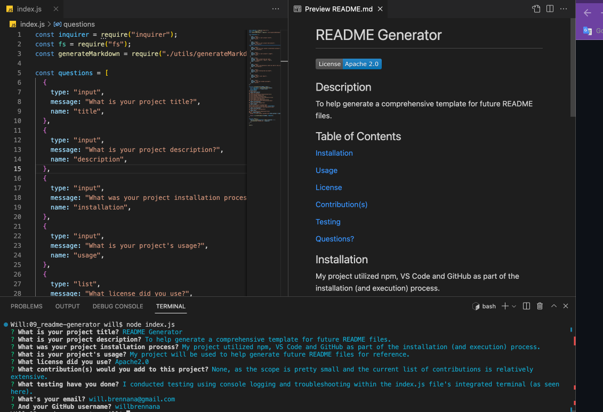

#Willy B's README Generator
This was my first backend project using node.js.

This week's challenge was a great introduction into the use of integrated terminals, npm and package.json files.

My primary focus for this debugging challenge was to expand the index.js file to include the questions for creating a templated README file, while the generateMarkdown.js file primarly served as a sandbox to include three unique licenses to choose from: Apache2.0, Boost and BSD provided by OpenSource.org.

After learning about all the ways to write cleaner, simpler code this past week, I found that some of the pseudocode provided could've asked for fewer lines within the generateMarkdown.js file.

Nonetheless, I tend to prefer debugging challenges, as they require you to work with code already provided—a scenario that seems more real-world than writing code from scratch.

As specified in the Challenge Acceptance Criteria, the generator achieves the following:

✨ A high-quality, professional README.md is generated with the title of my project and sections entitled Description, Table of Contents, Installation, Usage, License, Contributing, Tests, and Questions.

✨ Project name is displayed as the title of the README.

✨ A description, installation instructions, usage information, contribution guidelines, and test instructions are added to the sections of the README entitled Description, Installation, Usage, Contributing, and Tests.

✨ A badge for the chosen license is added near the top of the README and a notice is added to the section of the README entitled License that explains which license the application is covered under

✨ My GitHub username is added to the section of the README entitled Questions, with a link to my GitHub profile.

✨ My email is added to the section of the README entitled Questions, with instructions on how to reach me with additional questions.

✨ A Table of Contents takes me to the corresponding sections of the README file.

Below is a screenshot of my latest and greatest:

To check out the full experience, watch the .mov video titled "09_READMEGenerator" within this repository. Change for testing.
